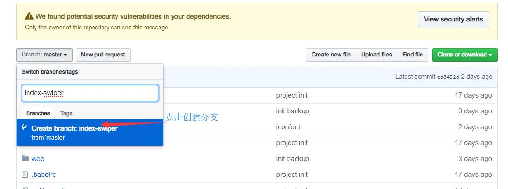

## 项目准备

### 安装NPM

> NPM是随同NodeJS一起安装的包管理工具。

* [Node.js下载地址](https://nodejs.org/en/about/releases/)选择对应的Node.js版本后安装。

``` javascript


npm config set registry http://registry.npm.taobao.org/  
# 修改 下载仓库地址为淘宝镜像

```

### 创建一个代码仓库

> 使用Github或者码云创建一个新的仓库并克隆到本地桌面。


``` Dos
  git clone xxx对应的仓库地址
```

### 安装vue-cli 命令行工具

> Vue 提供一个官方命令行工具，可用于快速搭建但也应用。工具为现代化的前端开发工作流提供了开箱即用的构建配置。

``` node
 cd desktop
# 进入桌面目录

 npm install --global vue-cli 
 # 全局安装 vue-cli

 vue init webpack 项目名称
 # 创建一个基于webpack 模版的新项目,项目名称就是我们对应我们刚刚创建的github仓库名,如果输入正确会提示我们桌面已有项目存在是否覆盖，回车确认。

```

> 如果运行**vue init webpack 项目名称**  后提示**bash: vue: command not found** 可以检查系统环境变量。

``` node
  npm root -g
  # 使用这个命令查看npm默认的环境变量
```

* 然后对比Windows环境变量。


* 修改Window中**Path**中的对应的环境变量。

* 修改成功后在运行 vue init webpack 项目名称

``` node
? Project name 项目名称                   
 # 确认项目名称，可修改，默认直接回车

? Project description "测试项目"
 # 确认项目描述

? Author syvue <XXXX@qq.com>
 # 确认项目作者

? Vue build standalone
 # 确认项目开发模式，选标准即可 回车

? Install vue-router? Yes
 # 确认是否安装 vue-router 组件  回车

? Use ESLint to lint your code? No
 # 确认是否开启 ESLint 代码格式检查 选NO

? Set up unit tests No
 # 是否安装单元测试 选NO

? Setup e2e tests with Nightwatch? No
 # 是否安装e2e 端到端测试 选NO

? Should we run `npm install` for you after the project has been created? (recommended) npm
 # 选择NPM或者Yarn 做包管理工具 ，我们选择NPM 直接回车
   vue-cli · Generated "my_app".


# Installing project dependencies ...
# ========================

To get started:

  cd my_app
  npm run dev

Documentation can be found at https://vuejs-templates.github.io/webpack
 
 cd my_app 
 # 按照提示输入命令 进入项目目录

 npm install
 # 安装依赖 

 npm run dev 
 # 开始运行调试开发模式 


```

* 完成之后打开 **http://localhost:8080**

### 项目目录说明


* build----项目构建(webpack)相关代码

* config-----配置目录，包括端口号等。我们初学可以使用默认的。

* node_modulesnpm---- 加载的项目依赖模块

* src----这里是我们要开发的目录，基本上要做的事情都在这个目录里。里面包含了几个目录及文件

* assets---- 放置一些图片，如logo等。

* components---- 目录里面放了一个组件文件，可以不用。

* App.vue----项目入口文件，我们也可以直接将组件写这里，而不使用 components 目录。

* main.js----项目的核心文件。

* static----静态资源目录，如图片、字体等。

* .xxxx,例如:**.babelrc.editorconfig.gitigore**---文件这些是一些配置文件，包括语法配置，git配置等。

* index.html----首页入口文件，你可以添加一些 meta 信息或统计代码啥的。

* package.json----项目配置文件。

* README.md----项目的说明文档，markdown 格式

### **.vue**单文件组件
> vue.js 自定义了一种.vue文件，可以把html, css, js 写到一个文件中，从而实现了对一个组件的封装， 一个.vue 文件就是一个单独的组件。由于.vue文件是Vue.js自定义的，浏览器不认识，所以需要对该文件进行解析。 在webpack构建中，需要安装vue-loader 对.vue文件进行解析。

``` html
复制代码
<template>
  <div class="hello">
    <h1>{{ msg }}</h1>
    <h2>Essential Links</h2>
  </div>
</template>

<script>
export default {
  name: 'hello',
  data () {
    return {
      msg: 'Welcome to Your Vue.js App'
    }
  }
}
</script>

<style scoped>
h1, h2 {
  font-weight: normal;
}

ul {
  list-style-type: none;
  padding: 0;
}

li {
  display: inline-block;
  margin: 0 10px;
}

a {
  color: #42b983;
}
</style> 
```
> 在 .vue 文件中， template 中都是html 代码，它定义了在页面中显示的内容，由于里面还有变量，也可以说定义了一个模版；script中都是js 代码，它定义这个组件中所需要的数据和及其操作，style 里面是css 样式，定义这个组件的样式，scoped 表明这里写的css 样式只适用于该组件，可以限定样式的作用域。

### 多页应用和单页应用


>**多页应用**
  优点：
> * 首屏时间：页面首个屏幕展现出来的时间。因为多页应用页面跳转只涉及一个http请求，服务器返回一个html文件。请求返回了，页面也就展示出来了，所以首屏时间快。
>  * SEO：搜索引擎优化效果。搜索引擎需要知道页面内容进行排名，它是可以知道html页面内容的。

> 缺点：
>  页面切换慢：每次切换页面都要发送htttp请求，如果网速慢，页面之间切换就会出现明显卡顿。  


> **单页应用**
> 利用Vue开发的应用是单页面应用，在url变化时，js会感知到，然后动态地将当前页面上的内容清除掉，再将下一个页面的内容挂载到页面上。此时，路由不是后端去做，而是由前端来做。
> 判断页面当前应该显示哪一个组件，清除掉上一个组件，显示下一个组件。这样页面跳转就不会去请求html文件了。

### Vue-Router
>  Vue Router 是 Vue.js 官方的路由管理器。它和 Vue.js 的核心深度集成，让构建单页面应用变得易如反掌。包含的功能有：嵌套的路由/视图表；模块化的、基于组件的路由配置；路由参数、查询、通配符；基于 Vue.js 过渡系统的视图过渡效果；细粒度的导航控制；带有自动激活的 CSS class 的链接；HTML5 历史模式或 hash 模式，在 IE9 中自动降级；自定义的滚动条行为。

``` javascript
import Vue from 'vue'
// 导入Vue
import Router from 'vue-router'
// 导入Vue-router 组件
import Home from '@/pages/home/Home'
// 导入己定义的Home.vue单文件组件
import About from '@/pages/about/About'
// 导入自定义的about.vue单文件组件

Vue.use(Router)
//router作为vue的插件被启动

export default new Router({
  routes: [
    {
      path: '/',
      name: 'Home',
      component: Home
    },
    {
      path: '/About',
      name: 'About',
      component: About
    }
  ]
})

```

* **router/index.js**

* **router-view** 和 **router-link** 


``` html
<div id="app">
  <h1>Hello App!</h1>
  <p>
    <!-- 使用 router-link 组件来导航. -->
    <!-- 通过传入 `to` 属性指定链接. -->
    <!-- <router-link> 默认会被渲染成一个 `<a>` 标签 -->
    <router-link to="/">Home</router-link>
    <router-link to="/about">About</router-link>
  </p>
  <!-- 路由出口 -->
  <!-- 路由匹配到的组件将渲染在这里 -->
  <router-view/>
</div>
```

<!-- * Stylus 样式表增强


* webpack 项目打包工具 -->

### 项目初始化


#### 导入依赖文件


> 首先将border.css,reset.css和iconfont相关文件复制到assets目录下的styles目录中。

* 其中border.css是用来解决移动端1px边框问题

* reset.css文件是用来解决移动端页面样式兼容性的问题

* iconfont相关文件是用来解决图标的问题
  > iconfont使用我们需要先登录**https://www.iconfont.cn/** 然后注册之后搜索我们需要的图标，然后下载，再将iconfont.css 复制到styles目录下 iconfont.eot iconfont.svg iconfont.ttf iconfont.woff 这4个字体文件复制sytles/iconfont目录下，然后修改iconfont.css文件，在对应的url地址上添加./iconfont目录，修改后如下图


#### 修改项目文件

* 新建项目目录和文件
  > 在src目录下新建pages目录，pages下在新建home目录，home目录下在新建Home.vue文件

``` html
<template>
     <div>
         <h2>hello World</h2>
     </div>
</template>

<script>
export default {
  name: 'Home'
}
</script>

<style scoped>

</style>

```
 **Home.vue** 

#### 修改路由文件
 > 打开router目录下的index.js文件，导入刚刚新建的Home.vue文件

 ``` javascript
import Vue from 'vue'
import Router from 'vue-router'
import Home from '@/pages/home/Home'

Vue.use(Router)

export default new Router({
  routes: [
    {
      path: '/',
      name: 'Home',
      component: Home
    }
  ]
})

 ``` 

#### 修改入口文件
 > 打开main.js文件，先打开终端安装导入fastClick的组件和其他依赖包
``` cmd
npm install fastclick --save
# 安装fastclick组件

npm install stylus --save
npm install stylus-loader --save
# 安装stylus 相关组件
```

``` javascript
import Vue from 'vue'
import App from './App'
import router from './router'
import fastClick from 'fastclick'
// 导入fastclick解决手机或浏览器可能的300毫秒延迟的问题
import './assets/styles/reset.css'
// 重置所有样式
import './assets/styles/border.css'
// 解决移动端1像素边框问题

Vue.config.productionTip = false
fastClick.attach(document.body)
// 调用fastClick绑定到document.body上

/* eslint-disable no-new */
new Vue({
  el: '#app',
  router,
  components: { App },
  template: '<App/>'
})

```
#### 修改index.html文件
 >打开index.html文件，修改meta name="viewport" content="width=device-width,initial-scale=1.0"这一项，在后面添加minimum-scale=1.0,maximum-scale=1.0,user-scalable=no三项。这是为了适配手机端
``` html
<!DOCTYPE html>
<html>
  <head>
    <meta charset="utf-8">
    <meta name="viewport" content="width=device-width,initial-scale=1.0", minimum-scale=1.0,maximum-scale=1.0,user-scalable=no>
    <title>app</title>
  </head>
  <body>
    <div id="app"></div>
    <!-- built files will be auto injected -->
  </body>
</html>

```

* 到这里我们就基本初始化项目完成,之后我们可以运行 npm run dev ，打开http://localhost:8080地址预览一下我们的修改结果。

* 一切完成后，将代码上传到代码仓库

``` git
git add .
git commit -m 'init project'
git push
```

### header组件区域

* 查看我们需要制作的页面。


> 我们在home目录下新建componets目录新建header.vue文件。


``` html
<template>
     <div class="header">
        <div class="header-left">
            <div class="iconfont back-icon">&#xe624;</div>
        </div>
        <div class="header-input">
              <span class="iconfont">&#xe632;</span>
                 输入城市/景点/游玩主题
        </div>
        <div class="header-right">
            城市
             <span class="iconfont arrow-icon">&#xe64a;</span>
        </div>
     </div>
</template>

<script>
export default {
  name: 'HomeHeader'
}
</script>

<style lang='stylus' scoped>
  .header
    display: flex
    line-height: .88rem
    background: #00afc7
    color: #fff
    .header-left
      width: .64rem
      float: left
      .back-icon
        text-align: center
        font-size: .4rem
    .header-input
      flex: 1
      height: .64rem
      line-height: .64rem
      margin-top: .12rem
      margin-left: .2rem
      padding-left: .2rem
      background: #fff
      border-radius: .1rem
      color: #ccc
    .header-right
      min-width: 1.04rem
      padding: 0 .1rem
      float: right
      text-align: center
      color: #fff
      .arrow-icon
        margin-left: -.04rem
        font-size: .24rem
</style>
```
* header.vue

``` html
<template>
     <div>
         <home-header></home-header>
     </div>
</template>

<script>
import HomeHeader from './components/Header'
export default {
  name: 'Home',
  components: {
    HomeHeader
  }
}
</script>

<style scoped>

</style>

```
* Home.vue

#### 代码优化

> src/assets/styles这个目录在项目中引用了多次，那么对于使用频率很高的目录我们就需要优化其使用流程，方便我们使用。首先我们打开bulid目录下的webpack.base.conf.js文件我们找到resolve下面的alias别名这一项，然后我们添加一项新的别名。

``` javascript
   resolve: {
    extensions: ['.js', '.vue', '.json'],
    alias: {
      'vue$': 'vue/dist/vue.esm.js',
      '@': resolve('src'),
      'styles': resolve('src/assets/styles')  
      //新添加的别名styles用来替换src/assets/styles这一段目录
    }
  }

```
* 然后我们就可以修改一下我们原来的文件，用新别名替换原来的 

> 在src/assets/styles下新建varibles.styl文件，然后打开varibles.styl文件。

``` css
$bgColor = #00bcd4
```
 * varibles.styl

> 然后在header.vue样式表部分导入 varibles.styl,就可以使用$bgcolor变量 

``` javascript
<style lang='stylus' scoped>
 @import '~styles/varibles.styl'
 //导入样式需要注意格式 
  .header
    bgackgournd: $bgColor
</style>
```
### 新建代码分支

> 在正式的商业项目中，当开发一个新的功能模块时，都需要创建一个分支，当开完完成之后我们再将分支合并到主分支中。这个时候我们先打开github中我们的项目页面，点击Branch:Master然后创建分支。



> 我们创建index-swiper分支是在线上，然后我们需要将线上分支拉到我们本机上

``` git 
 git pull
 # 我们先进入本地项目目录运行然后运行 git pull
 From https://github.com/syvue/app
 * [new branch]      index-swiper -> origin/index-swiper
 #运行之后 我们就会看到我们新建 index-swiper分支

 git checkout index-swiper
 # 运行 git checkout index-swiper 我们就好会从master分支切换到index-swiper这个新建的分支上

 git status 
 #  git status  这个命令是查看查看当前git状态
 

```
* 切换分支之后我的编写的代码都会在新的index-swiper分支之上

### 安装轮播图swiper插件

> 我们打开(https://github.com/surmon-china/vue-awesome-swiper)[https://github.com/surmon-china/vue-awesome-swiper]这个地址查先看一下这个插件的readme说明文档。考虑到兼容性和稳定性的问题，我们采用安装2.6.7这个版本

``` npm
npm install vue-awesome-swiper@2.6.7 --save
# 安装vue-awesome-swiper 2.6.7的版本
```
> 然后在main.js中引入vue-awesome-swiper 

``` javascript
import Vue from 'vue'
import App from './App'
import router from './router'
import fastClick from 'fastclick'
// 导入fastclick解决手机或浏览器可能的300毫秒延迟的问题
import VueAwesomeSwiper from 'vue-awesome-swiper'
// 导入VueAwesomeSwiper 组件
import './assets/styles/reset.css'
// 重置所有样式
import './assets/styles/border.css'
import './assets/styles/iconfont.css'
// 解决移动端1像素边框问题
import 'swiper/dist/css/swiper.css'
// 导入swiper样式表

Vue.config.productionTip = false
fastClick.attach(document.body)
// 调用fastClick绑定到document.body上
Vue.use(VueAwesomeSwiper)
// 调用VueAwesomeSwiper
/* eslint-disable no-new */
new Vue({
  el: '#app',
  router,
  components: { App },
  template: '<App/>'
})

```
> 我们在pages/home/components下新建Swiper.vue文件

``` javascript
<template>
     <swiper :options="swiperOption" >
    <!-- slides -->
    <swiper-slide>
    
    </swiper-slide>
    <swiper-slide>
    
    </swiper-slide>
    <swiper-slide>I'm Slide 3</swiper-slide>
    <swiper-slide>I'm Slide 4</swiper-slide>
    <!-- Optional controls -->
    <div class="swiper-pagination"  slot="pagination"></div>
  </swiper>
</template>

<script>
export default {
  name: 'HomeSwiper',
  data() {
    return {
      swiperOption:{}
    }
  }
 
}
</script >

<style lang='stylus' scoped>
 .swiper-img
   width: 100%
</style>

```
* Swiper.vue

* 同样的我们还需要在Home.vue中修改代码引入Swiper

``` javascript
<template>
     <div>
         <home-header></home-header>
         <home-swiper></home-swiper>
     </div>
</template>

<script>
import HomeHeader from './components/Header'
import HomeSwiper from './components/Swiper'

export default {
  name: 'Home',
  components: {
    HomeHeader,
    HomeSwiper
  }
}
</script>

<style scoped>

</style>

```
* Home.vue

#### 优化轮播图

> 在完成轮播图的基本功能之后，我们要需要继续优化代码来完善功能。我们先看代码

``` javascript
<template>
    <div class="wrapper">
      <!-- 在swiper外层添加一个类名为wrapper的div标签 -->
      <swiper :options="swiperOption" >
        <!-- slides -->
        <swiper-slide v-for='item of swiperList' :key='item.id'>
        
        </swiper-slide>
        <!-- Optional controls -->
        <!-- 利用v-for 来循环遍历 swiperList数组，添加绑定key值来实现轮播的顺序-->
        <div class="swiper-pagination"  slot="pagination"></div>
      </swiper>
    </div>
</template>

<script>
export default {
  name: 'HomeSwiper',
  data() {
    return {
      swiperOption:{
        pagination: '.swiper-pagination',
        //添加pagination选项并赋值.swiper-pagination来实现轮播图上圆点选项
        loop:true 
        //添加loop选项来实现轮播图的循环 
      },
      swiperList:[{
        id:'001',
        imgUrl:'http://mp-piao-admincp.qunarzz.com/mp_piao_admin_mp_piao_admin/admin/201910/c8762210baff5ade1a3b2fe0ab914992.png_750x200_9bbb2f51.png'
      },{
        id:'002',
        imgUrl:'http://mp-piao-admincp.qunarzz.com/mp_piao_admin_mp_piao_admin/admin/201911/1d8faa9f4d49b77ca1e61e2b478260f7.jpg_750x200_25cf76e2.jpg'
      },{
        id:'003',
        imgUrl:'http://mp-piao-admincp.qunarzz.com/mp_piao_admin_mp_piao_admin/admin/201910/e7eac5a5e99e6517c61b953c0fece63b.jpg_750x200_4b701cf8.jpg'
      },{
        id:'004',
        imgUrl:'http://mp-piao-admincp.qunarzz.com/mp_piao_admin_mp_piao_admin/admin/201911/6da1597f11456f5a42a1818ab3f6fa08.jpg_750x200_31b64c4a.jpg'
      }]
      //添加swiperList数组来实现管理轮播图播放的顺序和图片地址
    }
  }
 
}
</script>

<style lang='stylus' scoped>
  .wrapper >>> .swiper-pagination-bullet-active
    background: #fff
  .wrapper
    overflow: hidden
    width: 100%
    height: 0
    padding-bottom: 26.66%
    .swiper-img
      width: 100%
</style>

```

> 完成之后我们先保存代码然后推送到我们的远程代码仓库

``` Git
  git add .
  git commit -m 'swiper done'
  git push

```

> 然后我们在将 index-swiper这个分支合并到master 分支

``` Git
  git checkout master
  # 我们首先切换到master分支
  git merge origin/index-swiper
  # 将index-swiper分支先合并到本地master分支
  
```