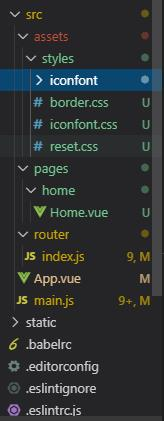

## 项目准备

### 安装NPM

> NPM是随同NodeJS一起安装的包管理工具。

* [Node.js下载地址](https://nodejs.org/en/about/releases/)选择对应的Node.js版本后安装。

``` javascript


npm config set registry http://registry.npm.taobao.org/  
# 修改 下载仓库地址为淘宝镜像

```

### 创建一个代码仓库

> 使用Github或者码云创建一个新的仓库并克隆到本地桌面。


``` Dos
  git clone xxx对应的仓库地址
```

### 安装vue-cli 命令行工具

> Vue 提供一个官方命令行工具，可用于快速搭建但也应用。工具为现代化的前端开发工作流提供了开箱即用的构建配置。

``` node
 cd desktop
# 进入桌面目录

 npm install --global vue-cli 
 # 全局安装 vue-cli

 vue init webpack 项目名称
 # 创建一个基于webpack 模版的新项目,项目名称就是我们对应我们刚刚创建的github仓库名,如果输入正确会提示我们桌面已有项目存在是否覆盖，回车确认。

```

> 如果运行**vue init webpack 项目名称**  后提示**bash: vue: command not found** 可以检查系统环境变量。

``` node
  npm root -g
  # 使用这个命令查看npm默认的环境变量
```

* 然后对比Windows环境变量。


* 修改Window中**Path**中的对应的环境变量。

* 修改成功后在运行 vue init webpack 项目名称

``` node
? Project name 项目名称                   
 # 确认项目名称，可修改，默认直接回车

? Project description "测试项目"
 # 确认项目描述

? Author syvue <XXXX@qq.com>
 # 确认项目作者

? Vue build standalone
 # 确认项目开发模式，选标准即可 回车

? Install vue-router? Yes
 # 确认是否安装 vue-router 组件  回车

? Use ESLint to lint your code? No
 # 确认是否开启 ESLint 代码格式检查 选NO

? Set up unit tests No
 # 是否安装单元测试 选NO

? Setup e2e tests with Nightwatch? No
 # 是否安装e2e 端到端测试 选NO

? Should we run `npm install` for you after the project has been created? (recommended) npm
 # 选择NPM或者Yarn 做包管理工具 ，我们选择NPM 直接回车
   vue-cli · Generated "my_app".


# Installing project dependencies ...
# ========================

To get started:

  cd my_app
  npm run dev

Documentation can be found at https://vuejs-templates.github.io/webpack
 
 cd my_app 
 # 按照提示输入命令 进入项目目录

 npm install
 # 安装依赖 

 npm run dev 
 # 开始运行调试开发模式 


```

* 完成之后打开 **http://localhost:8080**

### 项目目录说明


* build----项目构建(webpack)相关代码

* config-----配置目录，包括端口号等。我们初学可以使用默认的。

* node_modulesnpm---- 加载的项目依赖模块

* src----这里是我们要开发的目录，基本上要做的事情都在这个目录里。里面包含了几个目录及文件

* assets---- 放置一些图片，如logo等。

* components---- 目录里面放了一个组件文件，可以不用。

* App.vue----项目入口文件，我们也可以直接将组件写这里，而不使用 components 目录。

* main.js----项目的核心文件。

* static----静态资源目录，如图片、字体等。

* .xxxx,例如:**.babelrc.editorconfig.gitigore**---文件这些是一些配置文件，包括语法配置，git配置等。

* index.html----首页入口文件，你可以添加一些 meta 信息或统计代码啥的。

* package.json----项目配置文件。

* README.md----项目的说明文档，markdown 格式

### **.vue**单文件组件
> vue.js 自定义了一种.vue文件，可以把html, css, js 写到一个文件中，从而实现了对一个组件的封装， 一个.vue 文件就是一个单独的组件。由于.vue文件是Vue.js自定义的，浏览器不认识，所以需要对该文件进行解析。 在webpack构建中，需要安装vue-loader 对.vue文件进行解析。

``` html
复制代码
<template>
  <div class="hello">
    <h1>{{ msg }}</h1>
    <h2>Essential Links</h2>
  </div>
</template>

<script>
export default {
  name: 'hello',
  data () {
    return {
      msg: 'Welcome to Your Vue.js App'
    }
  }
}
</script>

<style scoped>
h1, h2 {
  font-weight: normal;
}

ul {
  list-style-type: none;
  padding: 0;
}

li {
  display: inline-block;
  margin: 0 10px;
}

a {
  color: #42b983;
}
</style> 
```
> 在 .vue 文件中， template 中都是html 代码，它定义了在页面中显示的内容，由于里面还有变量，也可以说定义了一个模版；script中都是js 代码，它定义这个组件中所需要的数据和及其操作，style 里面是css 样式，定义这个组件的样式，scoped 表明这里写的css 样式只适用于该组件，可以限定样式的作用域。

### 多页应用和单页应用


>**多页应用**
  优点：
> * 首屏时间：页面首个屏幕展现出来的时间。因为多页应用页面跳转只涉及一个http请求，服务器返回一个html文件。请求返回了，页面也就展示出来了，所以首屏时间快。
>  * SEO：搜索引擎优化效果。搜索引擎需要知道页面内容进行排名，它是可以知道html页面内容的。

> 缺点：
>  页面切换慢：每次切换页面都要发送htttp请求，如果网速慢，页面之间切换就会出现明显卡顿。  


> **单页应用**
> 利用Vue开发的应用是单页面应用，在url变化时，js会感知到，然后动态地将当前页面上的内容清除掉，再将下一个页面的内容挂载到页面上。此时，路由不是后端去做，而是由前端来做。
> 判断页面当前应该显示哪一个组件，清除掉上一个组件，显示下一个组件。这样页面跳转就不会去请求html文件了。

### Vue-Router
>  Vue Router 是 Vue.js 官方的路由管理器。它和 Vue.js 的核心深度集成，让构建单页面应用变得易如反掌。包含的功能有：嵌套的路由/视图表；模块化的、基于组件的路由配置；路由参数、查询、通配符；基于 Vue.js 过渡系统的视图过渡效果；细粒度的导航控制；带有自动激活的 CSS class 的链接；HTML5 历史模式或 hash 模式，在 IE9 中自动降级；自定义的滚动条行为。

``` javascript
import Vue from 'vue'
// 导入Vue
import Router from 'vue-router'
// 导入Vue-router 组件
import Home from '@/pages/home/Home'
// 导入己定义的Home.vue单文件组件
import About from '@/pages/about/About'
// 导入自定义的about.vue单文件组件

Vue.use(Router)
//router作为vue的插件被启动

export default new Router({
  routes: [
    {
      path: '/',
      name: 'Home',
      component: Home
    },
    {
      path: '/About',
      name: 'About',
      component: About
    }
  ]
})

```

* **router/index.js**

* **router-view** 和 **router-link** 


``` html
<div id="app">
  <h1>Hello App!</h1>
  <p>
    <!-- 使用 router-link 组件来导航. -->
    <!-- 通过传入 `to` 属性指定链接. -->
    <!-- <router-link> 默认会被渲染成一个 `<a>` 标签 -->
    <router-link to="/">Home</router-link>
    <router-link to="/about">About</router-link>
  </p>
  <!-- 路由出口 -->
  <!-- 路由匹配到的组件将渲染在这里 -->
  <router-view/>
</div>
```

<!-- * Stylus 样式表增强


* webpack 项目打包工具 -->


### 项目初始化

#### 导入依赖文件


> 首先将border.css,reset.css和iconfont相关文件复制到assets目录下的styles目录中。

* 其中border.css是用来解决移动端1px边框问题

* reset.css文件是用来解决移动端页面样式兼容性的问题

* iconfont相关文件是用来解决图标的问题
  > iconfont使用我们需要先登录**https://www.iconfont.cn/** 然后注册之后搜索我们需要的图标，然后下载，再将iconfont.css 复制到styles目录下 iconfont.eot iconfont.svg iconfont.ttf iconfont.woff 这4个字体文件复制sytles/iconfont目录下，然后修改iconfont.css文件，在对应的url地址上添加./iconfont目录，修改后如下图


#### 修改项目文件

* 新建项目目录和文件
  > 在src目录下新建pages目录，pages下在新建home目录，home目录下在新建Home.vue文件

``` html
<template>
     <div>
         <h2>hello World</h2>
     </div>
</template>

<script>
export default {
  name: 'Home'
}
</script>

<style scoped>

</style>

```
 **Home.vue** 

#### 修改路由文件
 > 打开router目录下的index.js文件，导入刚刚新建的Home.vue文件

 ``` javascript
import Vue from 'vue'
import Router from 'vue-router'
import Home from '@/pages/home/Home'

Vue.use(Router)

export default new Router({
  routes: [
    {
      path: '/',
      name: 'Home',
      component: Home
    }
  ]
})

 ``` 

#### 修改入口文件
 > 打开main.js文件，先打开终端安装导入fastClick的组件和其他依赖包
``` cmd
npm install fastclick --save
# 安装fastclick组件

npm install stylus --save
npm install stylus-loader --save
# 安装stylus 相关组件
```

``` javascript
import Vue from 'vue'
import App from './App'
import router from './router'
import fastClick from 'fastclick'
// 导入fastclick解决手机或浏览器可能的300毫秒延迟的问题
import './assets/styles/reset.css'
// 重置所有样式
import './assets/styles/border.css'
// 解决移动端1像素边框问题

Vue.config.productionTip = false
fastClick.attach(document.body)
// 调用fastClick绑定到document.body上

/* eslint-disable no-new */
new Vue({
  el: '#app',
  router,
  components: { App },
  template: '<App/>'
})

```
#### 修改index.html文件
 >打开index.html文件，修改meta name="viewport" content="width=device-width,initial-scale=1.0"这一项，在后面添加minimum-scale=1.0,maximum-scale=1.0,user-scalable=no三项。这是为了适配手机端
``` html
<!DOCTYPE html>
<html>
  <head>
    <meta charset="utf-8">
    <meta name="viewport" content="width=device-width,initial-scale=1.0, minimum-scale=1.0,maximum-scale=1.0,user-scalable=no">
    <title>app</title>
  </head>
  <body>
    <div id="app"></div>
    <!-- built files will be auto injected -->
  </body>
</html>

```

* 到这里我们就基本初始化项目完成,之后我们可以运行 npm run dev ，打开http://localhost:8080地址预览一下我们的修改结果。

* 一切完成后，将代码上传到代码仓库

``` git
git add .
git commit -m 'init project'
git push
```

### header组件区域

* 查看我们需要制作的页面。


> 我们在home目录下新建componets目录新建header.vue文件。


``` html
<template>
     <div class="header">
        <div class="header-left">
            <div class="iconfont back-icon">&#xe624;</div>
        </div>
        <div class="header-input">
              <span class="iconfont">&#xe632;</span>
                 输入城市/景点/游玩主题
        </div>
        <div class="header-right">
            城市
             <span class="iconfont arrow-icon">&#xe64a;</span>
        </div>
     </div>
</template>

<script>
export default {
  name: 'HomeHeader'
}
</script>

<style lang='stylus' scoped>
  .header
    display: flex
    line-height: .88rem
    background: #00afc7
    color: #fff
    .header-left
      width: .64rem
      float: left
      .back-icon
        text-align: center
        font-size: .4rem
    .header-input
      flex: 1
      height: .64rem
      line-height: .64rem
      margin-top: .12rem
      margin-left: .2rem
      padding-left: .2rem
      background: #fff
      border-radius: .1rem
      color: #ccc
    .header-right
      min-width: 1.04rem
      padding: 0 .1rem
      float: right
      text-align: center
      color: #fff
      .arrow-icon
        margin-left: -.04rem
        font-size: .24rem
</style>
```
* header.vue

``` html
<template>
     <div>
         <home-header></home-header>
     </div>
</template>

<script>
import HomeHeader from './components/Header'
export default {
  name: 'Home',
  components: {
    HomeHeader
  }
}
</script>

<style scoped>

</style>

```
* Home.vue

#### 代码优化

> src/assets/styles这个目录在项目中引用了多次，那么对于使用频率很高的目录我们就需要优化其使用流程，方便我们使用。首先我们打开bulid目录下的webpack.base.conf.js文件我们找到resolve下面的alias别名这一项，然后我们添加一项新的别名。

``` javascript
   resolve: {
    extensions: ['.js', '.vue', '.json'],
    alias: {
      'vue$': 'vue/dist/vue.esm.js',
      '@': resolve('src'),
      'styles': resolve('src/assets/styles')  
      //新添加的别名styles用来替换src/assets/styles这一段目录
    }
  }

```
* 然后我们就可以修改一下我们原来的文件，用新别名替换原来的 

> 在src/assets/styles下新建varibles.styl文件，然后打开varibles.styl文件。

``` css
$bgColor = #00bcd4
```
 * varibles.styl

> 然后在header.vue样式表部分导入 varibles.styl,就可以使用$bgcolor变量 

``` javascript
<style lang='stylus' scoped>
 @import '~styles/varibles.styl'
 //导入样式需要注意格式 
  .header
    bgackgournd: $bgColor
</style>
```
### 新建代码分支

> 在正式的商业项目中，当开发一个新的功能模块时，都需要创建一个分支，当开完完成之后我们再将分支合并到主分支中。这个时候我们先打开github中我们的项目页面，点击Branch:Master然后创建分支。


> 我们创建index-swiper分支是在线上，然后我们需要将线上分支拉到我们本机上

``` git 
 git pull
 # 我们先进入本地项目目录运行然后运行 git pull
 From https://github.com/syvue/app
 * [new branch]      index-swiper -> origin/index-swiper
 #运行之后 我们就会看到我们新建 index-swiper分支

 git checkout index-swiper
 # 运行 git checkout index-swiper 我们就好会从master分支切换到index-swiper这个新建的分支上

 git status 
 #  git status  这个命令是查看查看当前git状态
 

```
* 切换分支之后我的编写的代码都会在新的index-swiper分支之上

### 安装轮播图swiper插件

> 我们打开[https://github.com/surmon-china/vue-awesome-swiper](https://github.com/surmon-china/vue-awesome-swiper)这个地址查先看一下这个插件的readme说明文档。考虑到兼容性和稳定性的问题，我们采用安装2.6.7这个版本

``` npm
npm install vue-awesome-swiper@2.6.7 --save
# 安装vue-awesome-swiper 2.6.7的版本
```
> 然后在main.js中引入vue-awesome-swiper 

``` javascript
import Vue from 'vue'
import App from './App'
import router from './router'
import fastClick from 'fastclick'
// 导入fastclick解决手机或浏览器可能的300毫秒延迟的问题
import VueAwesomeSwiper from 'vue-awesome-swiper'
// 导入VueAwesomeSwiper 组件
import './assets/styles/reset.css'
// 重置所有样式
import './assets/styles/border.css'
import './assets/styles/iconfont.css'
// 解决移动端1像素边框问题
import 'swiper/dist/css/swiper.css'
// 导入swiper样式表

Vue.config.productionTip = false
fastClick.attach(document.body)
// 调用fastClick绑定到document.body上
Vue.use(VueAwesomeSwiper)
// 调用VueAwesomeSwiper
/* eslint-disable no-new */
new Vue({
  el: '#app',
  router,
  components: { App },
  template: '<App/>'
})

```
> 我们在pages/home/components下新建Swiper.vue文件

``` javascript
<template>
     <swiper :options="swiperOption" >
    <!-- slides -->
    <swiper-slide>
    
    </swiper-slide>
    <swiper-slide>
    
    </swiper-slide>
    <swiper-slide>I'm Slide 3</swiper-slide>
    <swiper-slide>I'm Slide 4</swiper-slide>
    <!-- Optional controls -->
    <div class="swiper-pagination"  slot="pagination"></div>
  </swiper>
</template>

<script>
export default {
  name: 'HomeSwiper',
  data() {
    return {
      swiperOption:{}
    }
  }
 
}
</script >

<style lang='stylus' scoped>
 .swiper-img
   width: 100%
</style>

```
* Swiper.vue

* 同样的我们还需要在Home.vue中修改代码引入Swiper

``` javascript
<template>
     <div>
         <home-header></home-header>
         <home-swiper></home-swiper>
     </div>
</template>

<script>
import HomeHeader from './components/Header'
import HomeSwiper from './components/Swiper'

export default {
  name: 'Home',
  components: {
    HomeHeader,
    HomeSwiper
  }
}
</script>

<style scoped>

</style>

```
* Home.vue

#### 优化轮播图

> 在完成轮播图的基本功能之后，我们要需要继续优化代码来完善功能。我们先看代码

``` javascript
<template>
    <div class="wrapper">
      <!-- 在swiper外层添加一个类名为wrapper的div标签 -->
      <swiper :options="swiperOption" >
        <!-- slides -->
        <swiper-slide v-for='item of swiperList' :key='item.id'>
        
        </swiper-slide>
        <!-- Optional controls -->
        <!-- 利用v-for 来循环遍历 swiperList数组，添加绑定key值来实现轮播的顺序-->
        <div class="swiper-pagination"  slot="pagination"></div>
      </swiper>
    </div>
</template>

<script>
export default {
  name: 'HomeSwiper',
  data() {
    return {
      swiperOption:{
        pagination: '.swiper-pagination',
        //添加pagination选项并赋值.swiper-pagination来实现轮播图上圆点选项
        loop:true 
        //添加loop选项来实现轮播图的循环 
      },
      swiperList:[{
        id:'001',
        imgUrl:'http://mp-piao-admincp.qunarzz.com/mp_piao_admin_mp_piao_admin/admin/201910/c8762210baff5ade1a3b2fe0ab914992.png_750x200_9bbb2f51.png'
      },{
        id:'002',
        imgUrl:'http://mp-piao-admincp.qunarzz.com/mp_piao_admin_mp_piao_admin/admin/201911/1d8faa9f4d49b77ca1e61e2b478260f7.jpg_750x200_25cf76e2.jpg'
      },{
        id:'003',
        imgUrl:'http://mp-piao-admincp.qunarzz.com/mp_piao_admin_mp_piao_admin/admin/201910/e7eac5a5e99e6517c61b953c0fece63b.jpg_750x200_4b701cf8.jpg'
      },{
        id:'004',
        imgUrl:'http://mp-piao-admincp.qunarzz.com/mp_piao_admin_mp_piao_admin/admin/201911/6da1597f11456f5a42a1818ab3f6fa08.jpg_750x200_31b64c4a.jpg'
      }]
      //添加swiperList数组来实现管理轮播图播放的顺序和图片地址
    }
  }
 
}
</script>

<style lang='stylus' scoped>
  .wrapper >>> .swiper-pagination-bullet-active
    background: #fff
    //实现.wrapper对.swiper-pagination-bullet-active的样式穿透
  .wrapper
    overflow: hidden
    width: 100%
    height: 0
    padding-bottom: 26.66%
    // .wrapper实现按比例占位
    .swiper-img
      width: 100%
</style>

```

> 完成之后我们先保存代码然后推送到我们的远程代码仓库

``` Git
  git add .
  git commit -m 'swiper done'
  git push

```

> 然后我们在将 index-swiper这个分支合并到master 分支

``` Git
  git checkout master
  # 我们首先切换到master分支
  git merge origin/index-swiper
  # 将index-swiper分支先合并到本地master分支
<<<<<<< HEAD
<<<<<<< HEAD
  
```

=======
  git push 
  # 在将master分支的推送到远程仓库
```
>>>>>>> index-icons
=======
  
```

  git push 
  # 在将master分支的推送到远程仓库
```
>>>>>>> origin/index-ajax
### 完成图标区域布局

* 首先我们在github上创建一个新的 index-icons分支,然后我们要切换到index-icons这个分支上。

``` git
  git pull
  # 创建完分支之后，我首先在本地拉取一下这个分支
  git checkout index-icons
  # 然后切换到index-icons这个分支开始开发
```
> 我们首先在components文件夹下面新建Icons.vue这个文件，然后并在Home.vue添加HomeIcons这个组件实现基本的布局

<<<<<<< HEAD
<<<<<<< HEAD

``` javascript
=======
```  javascript
>>>>>>> index-icons
=======

``` javascript
```  javascript
>>>>>>> origin/index-ajax
<template>
     <div>
         <home-header></home-header>
         <home-swiper></home-swiper>
         <home-icons></home-icons>
     </div>
</template>

<script>
import HomeHeader from './components/Header'
import HomeSwiper from './components/Swiper'
import HomeIcons from './components/Icons'
//添加 HomeIcons组件
export default {
  name: 'Home',
  components: {
    HomeHeader,
    HomeSwiper,
    HomeIcons
  }
}
</script>

<style scoped>

</style>
<<<<<<< HEAD
<<<<<<< HEAD
=======
>>>>>>> origin/index-ajax

```

* Home.vue


<<<<<<< HEAD
=======
```
* Home.vue

>>>>>>> index-icons
``` javascript
<template>
   <div class='icons'>
    <!-- icons是最外层-->
=======
``` javascript
<template>
   <div class='icons'>
    <!-- icons是最外层-->
```
* Home.vue

``` javascript
<template>
   <div class='icons'>
>>>>>>> origin/index-ajax
      <div class="icon">
        <div class='icon-img'>
          
        </div>
        <p class="icons-desc">景点门票</p>
      </div>
      <!-- icon层代表一个图标层-->
<<<<<<< HEAD
=======

>>>>>>> origin/index-ajax
      <div class="icon">
          <div class='icon-img'>
            
          </div>
          <p class="icons-desc">一日游</p>
      </div>
     
   </div>
</template>

<script>
export default {
  name: 'HomeIcons'
}
</script>

<style lang='stylus' scoped>
  .icons
    overflow: hidden
    height: 0
    padding-bottom: 50%
    background: #eee
    //icons 层样式
    .icon
      position: relative
      overflow: hidden
      float: left
      width: 25%
      height: 0
      padding-bottom: 25%
<<<<<<< HEAD
      //单个icon层样式
=======
<<<<<<< HEAD
      //单个icon层样式
=======
>>>>>>> origin/index-icons
>>>>>>> origin/index-ajax
      .icon-img
        position: absolute
        top: 0
        left: 0
        right: 0
        bottom: .44rem
        box-sizing: border-box
        .icon-img-content
          display: block
          margin: 0 auto
          height: 100%
      .icons-desc
        position: absolute
        left: 0
        right: 0
        bottom: 0
        height: .44rem
        line-height: .44rem
        text-align: center
</style>
<<<<<<< HEAD
<<<<<<< HEAD
=======
>>>>>>> origin/index-ajax

```

* Icons.vue

### 图标区逻辑实现

* 实现图标区的移动我们同样要使用到swiper组件对代码进行改造，代码如下。

``` javascript
<template>
    <div class="icons">
        <swiper :options="swiperOption">
            <swiper-slide v-for='(page, index) of pages' :key='index'>
            // 通过v-for 来遍历 pages 来实现图标区分页
                <div class="icon" v-for="item of page" :key="item.id">
                //通过 v-for 来遍历 page来实现单页里的图标按顺序排列
                    <div class="icon-img">
                        
                    </div>
                    <p class="icon-desc">{{item.desc}}</p>
                </div>
            </swiper-slide>
        </swiper>
    </div>
</template>

<script>
export default {
  name: 'HomeIcons',
  data () {
    return {
      swiperOption: {
        // autoplay自动播放除了有true和false值以外，还可以直接指定轮播的时间间隔 例如autoplay: 5000
        autoplay: false
      },
      iconList: [{
        id: '001',
        imgUrl: 'http://img1.qunarzz.com/piao/fusion/1803/95/f3dd6c383aeb3b02.png',
        desc: '景点门票'
      }, {
        id: '002',
        imgUrl: 'http://mp-piao-admincp.qunarzz.com/mp_piao_admin_mp_piao_admin/admin/20194/3ef092d0a89ffddb7f781cda30c8ae49.png',
        desc: '错峰出行'
      }, {
        id: '003',
        imgUrl: 'http://img1.qunarzz.com/piao/fusion/1803/ea/01d081dacb03cc02.png',
        desc: '赏秋色'
      }, {
        id: '004',
        imgUrl: 'http://img1.qunarzz.com/piao/fusion/1804/5a/13ceb38dcf262f02.png',
        desc: '一日游'
      }, {
        id: '005',
        imgUrl: 'http://img1.qunarzz.com/piao/fusion/1803/fa/2548667cb6e902.png',
        desc: '上海自然博物馆'
      }, {
        id: '006',
        imgUrl: 'http://img1.qunarzz.com/piao/fusion/1803/3e/86314b2af03b7502.png',
        desc: '黄浦江游船'
      }, {
        id: '007',
        imgUrl: 'http://img1.qunarzz.com/piao/fusion/1803/47/c2b659e048b11602.png',
        desc: '上海野生'
      }, {
        id: '008',
        imgUrl: 'http://img1.qunarzz.com/piao/fusion/1803/de/f26be47a6bf02a02.png',
        desc: '上海迪士尼'
      }, {
        id: '009',
        imgUrl: 'http://img1.qunarzz.com/piao/fusion/1803/95/8246f27355943202.png',
        desc: '世纪公园'
      }]
    }
  },
  // 通过computed来计算图标区的分页
  computed: {
    pages () {
      const pages = []
      this.iconList.forEach((item, index) => {
        //index是图标数组的索引，利用索引除以8来计算是否分页
        const page = Math.floor(index / 8)
        if (!pages[page]) {
          pages[page] = []
        }
        pages[page].push(item)
      })
      return pages
    }
  }
}
</script>

<style lang="stylus" scoped>
@import '~styles/varibles.styl';
     .icons >>> .swiper-container
       height 0
       padding-bottom 50%
       background #eee
     .icon
       overflow hidden
       float left
       width 25%
       height 0
       padding-bottom 25%
       position relative
       .icon-img
         position absolute
         top 0
         left 0
         right 0
         bottom .44rem
         box-sizing border-box
         .icon-img-content
           display block
           margin 0 auto
           height 100%
        .icon-desc
          position absolute
          left 0
          right 0
          bottom 0
          height .44rem
          line-height .44rem
          text-align center
          ellipsis()
</style>

```

* Icons.vue

``` javascript

$bgColor = #00bcd4

ellipsis()
  overflow hidden
  white-space nowrap
  text-overflow ellipsis

```

* varibles.styl

<<<<<<< HEAD
### 热榜区域实现

* 首先在线上仓库Github中创建新的分支，然后在本地拉取并切换新的index-Hot分支。再在components目录下创建Hot.vue文件，然后利用swiper组件实现我们要的效果，代码如下。

``` javascript
<template>
  <div>
      <div class="title">
        
        <span class='title-left'>本周热门榜单</span>
        <span class="title-right">全部榜单 ></span>
        </div>
      <div class="wrapper">
          <swiper :options='swiperOption'>
              <swiper-slide v-for='item of hotList' :key='item.id'>
                  <div class="hot-img">
                    
                  </div>  
                    <p class="desc">{{item.desc}}</p>
                    <p class="price">{{item.price}}<span>起</span></p>
              </swiper-slide>
          </swiper>
      </div>
  </div>
</template>

<script>
export default {
  name:'HomeHot',
  data () {
    return {
      swiperOption: {
        slidesPerView : 3.5,
        //设置slider容器能够同时显示的slides数量(carousel模式)。
        centeredSlides : false
        //默认状态下活动块居左，设定为true时，活动块会居中
      },
      hotList:[{
        id:'001',
        imgUrl: 'http://img1.qunarzz.com/sight/p0/1607/7c/7cda8b6782dabd80b4.img.jpg_250x250_57ac4faa.jpg',
        desc: '上海迪士尼乐园',
        price: '¥352'
      }, {
        id:'002',
        imgUrl: 'http://img1.qunarzz.com/sight/p0/1811/e4/e4b9b471d2afc473a3.img.jpg_250x250_963fe222.jpg',
        desc: '上海欢乐谷',
        price: '¥159'
      }, {
        id:'003',
        imgUrl: 'http://img1.qunarzz.com/tuan/team2/1507/2c/83e0e0e7ae082a.jpg_250x250_87692c41.jpg',
        desc: '东方明珠',
        price: '¥80'
      }, {
        id:'004',
        imgUrl: 'http://img1.qunarzz.com/sight/p0/1906/19/19b7939928a0200da3.img.jpg_250x250_170cb921.jpg',
        desc: '上海海昌海洋公园',
        price: '¥139'
      }, {
        id:'005',
        imgUrl: 'http://img1.qunarzz.com/sight/p0/1803/26/2645c1b2ee526285a3.water.jpg_250x250_c9ab8185.jpg',
        desc: '黄浦江游览（十六铺码头）',
        price: '¥80'
      }, {
        id:'006',
        imgUrl: 'http://img1.qunarzz.com/sight/p0/1607/7c/7cda8b6782dabd80b4.img.jpg_250x250_57ac4faa.jpg',
        desc: '上海迪士尼乐园',
        price: '¥352'
      }, {
        id:'007',
        imgUrl: 'http://img1.qunarzz.com/sight/p0/1607/7c/7cda8b6782dabd80b4.img.jpg_250x250_57ac4faa.jpg',
        desc: '上海迪士尼乐园',
        price: '¥352'
      }, {
        id:'008',
        imgUrl: 'http://img1.qunarzz.com/sight/p0/1811/e4/e4b9b471d2afc473a3.img.jpg_250x250_963fe222.jpg',
        desc: '上海欢乐谷',
        price: '¥159'
      }, {
        id:'009',
        imgUrl: 'http://img1.qunarzz.com/tuan/team2/1507/2c/83e0e0e7ae082a.jpg_250x250_87692c41.jpg',
        desc: '东方明珠',
        price: '¥80'
      }, {
        id:'010',
        imgUrl: 'http://img1.qunarzz.com/sight/p0/1906/19/19b7939928a0200da3.img.jpg_250x250_170cb921.jpg',
        desc: '上海海昌海洋公园',
        price: '¥139'
      }, {
        id:'011',
        imgUrl: 'http://img1.qunarzz.com/sight/p0/1803/26/2645c1b2ee526285a3.water.jpg_250x250_c9ab8185.jpg',
        desc: '黄浦江游览（十六铺码头）',
        price: '¥80'
      }]
    }

    }
  }

</script>

<style lang="stylus" scoped>
@import '~styles/varibles.styl'
  .title
    position relative
    padding .2rem
    padding-bottom -.1rem
    .title-left
      font-size .32rem;
      line-height .44rem
    .title-img
      display: inline-block;
      overflow: hidden;
      width: .3rem;
      height: .3rem;
      vertical-align: top;
    .title-right
      float right
      color: #616161;
      font-size: .24rem;
      line-height: .28rem;
      position: absolute;
      top: .36rem;
      right: .32rem;
  .wrapper
    height 0
    padding-bottom 40%
    overflow hidden
    width: 100%
    .hot-img
      overflow hidden
      height 24%
      margin-top -.2rem
      .hot-img-content
        margin .15rem
        width: 100%
    .desc
      text-align center
      font-size .24rem
      margin-top .12rem
      line-height: .32rem
      color #212121
      ellipsis()
    .price
      text-align center
      color #ff8300
      span
        color #212121
        font-size .24rem
</style>
```
* hot.vue


``` javascript
<template>
     <div>
         <home-header></home-header>
         <home-swiper></home-swiper>
         <home-hot></home-hot>
     </div>
</template>

<script>
import HomeHeader from './components/Header'
import HomeSwiper from './components/Swiper'
import HomeHot from './components/Hot'
export default {
  name: 'Home',
  components: {
    HomeHeader,
    HomeSwiper,
    HomeHot
  }
}
</script>

<style scoped>

</style>
```
* home.vue

* 完成之后，先保存代码到远程仓库，然后在合并代码到主分支。

``` cmd
  git add .
  git commit -m 'hot done'
  git push
  # 保存代码
  git checkout master
  # 我们首先切换到master分支
  git merge origin/index-hot
  # 将index-hot分支先合并到本地master分支
```
### 实现猜你喜欢区域

* 同样的，先创建分支，在切换到分支上开始编码，代码如下。

``` javascript
<template>
  <div>
    <div class="title">
      
      <span class="title-content">猜你喜欢</span>
    </div>
    <ul>
      <li class="item" v-for='item of likeList' :key='item.id'>
        
        <div class="item-info">
          <p class="item-title">{{item.title}}</p>
          <p>
            <span class="iconfont" v-html='item.star'>{{item.star}}</span >
            <!--因为data里返回的数据类型并不会直接识别为代码，所有我们需要用到v-html来识别星星的的代码-->
            <span class="item-comment">{{item.comment}}</span>
          </p>
          <p class="item-price"><em>¥</em>{{item.price}}<span>起</span></p>
          <p class="item-desc">{{item.desc}}</p>
        </div>
      </li>
  
    </ul>
  </div>
</template>

<script>
export default {
  name:'HomeLiked',
  data () {
    return {
      likeList: [{
        id: '001',
        imgUrl: 'http://img1.qunarzz.com/sight/p0/1607/7c/7cda8b6782dabd80b4.img.jpg_200x200_2039e660.jpg',
        title: '上海迪士尼乐园',
        star:'&#xe6b0;&#xe6b0;&#xe6b0;&#xe6b0;&#xe6b0;',
        comment:'277442条评论',
        price: '394',
        desc: '全球最大的迪士尼城堡'
      }, {
        id: '002',
        imgUrl: 'http://img1.qunarzz.com/tuan/team2/1507/2c/83e0e0e7ae082a.jpg_200x200_6d7378b2.jpg',
        title: '东方明珠',
        star:'&#xe6b0;&#xe6b0;&#xe6b0;&#xe6b0;&#xe6b0;',
        comment:'87877条评论',
        price: '80',
        desc: '259米透明悬空观光廊了解一下~'
      }, {
        id: '003',
        imgUrl: 'http://img1.qunarzz.com/sight/p0/1906/19/19b7939928a0200da3.img.jpg_200x200_6879c7f7.jpg',
        title: '上海海昌海洋公园',
        star:'&#xe6b0;&#xe6b0;&#xe6b0;&#xe6b0;&#xe6b0;',
        comment:'25826条评论',
        price: '139',
        desc: '全球最大的迪士尼城堡'
      }, {
        id: '004',
        imgUrl: 'http://img1.qunarzz.com/sight/p0/1607/7c/7cda8b6782dabd80b4.img.jpg_200x200_2039e660.jpg',
        title: '上海迪士尼乐园',
        star:'&#xe6b0;&#xe6b0;&#xe6b0;&#xe6b0;&#xe6b0;',
        comment:'277442条评论',
        price: '394',
        desc: '全球最大的迪士尼城堡'
      },  {
        id: '005',
        imgUrl: 'http://img1.qunarzz.com/tuan/team2/1507/2c/83e0e0e7ae082a.jpg_200x200_6d7378b2.jpg',
        title: '东方明珠',
        star:'&#xe6b0;&#xe6b0;&#xe6b0;&#xe6b0;&#xe6b0;',
        comment:'87877条评论',
        price: '80',
        desc: '259米透明悬空观光廊了解一下~'
      }, {
        id: '006',
        imgUrl: 'http://img1.qunarzz.com/sight/p0/1906/19/19b7939928a0200da3.img.jpg_200x200_6879c7f7.jpg',
        title: '上海海昌海洋公园',
        star:'&#xe6b0;&#xe6b0;&#xe6b0;&#xe6b0;&#xe6b0;',
        comment:'25826条评论',
        price: '139',
        desc: '全球最大的迪士尼城堡'
      }
      ]
    }
  }
}
</script>

<style lang="stylus" scoped>
  .title
    margin-top .2rem
    background #eee
    padding .2rem
    .title-img
      width .3rem
      height .3rem
      margin-top -.09rem
    .title-content
      margin-left: .08rem
      height: .44rem
      color: red
      font-size: .32rem
      line-height: .44rem
  .item
    overflow: hidden
    display: flex
    height: 1.9rem
    padding-bottom 1rem
    border-bottom 1px solid #ccc
    .item-img
      width: 2rem
      height: 2rem
      padding: .2rem
    .item-info
      flex 1
      padding: .1rem
      margin-top .3rem
      min-width: 0
      .item-title
        height: .44rem
        color: #212121
        font-size: .32rem
        line-height: .44rem
        margin-bottom .1rem
      .iconfont
          color #ffb436
          font-size .25rem
      .item-comment
            color #212121
            margin-left .2rem
      .item-price
        font-size: .4rem
        color #ffb436
        margin-top .2rem
        em
          font-size: .25rem
        span
          color #616161
          font-size: .25rem
      .item-desc
        margin-top .6rem
        color #f55
        font-size .24rem
</style>
```
* like.vue

``` javascript
<template>
     <div>
         <home-header></home-header>
         <home-swiper></home-swiper>
         <home-hot></home-hot>
         <home-liked></home-liked>
     </div>
</template>

<script>
import HomeHeader from './components/Header'
import HomeSwiper from './components/Swiper'
import HomeHot from './components/Hot'
import HomeLiked from './components/Liked'
export default {
  name: 'Home',
  components: {
    HomeHeader,
    HomeSwiper,
    HomeHot,
    HomeLiked
  }
}
</script>

<style scoped>

</style>

```
* Home.vue

    
### 周末去哪儿区域

* 我们先在components下创建**Weekend.vue**文件，代码如下：

```javascript
<template>
  <div>
    <div class="title">周末去哪儿</div>
    <ul>
        <li class="item border-bottom" v-for="item of itemList" :key="item.id">
          <div class="item-img-wrapper">
            
          </div>
          <div class="item-info">
            <p class="item-title">{{item.title}}</p>
            <p class="item-desc">{{item.desc}}</p>
          </div>
        </li>
    </ul> 
  </div>
</template>

<script>
export default {
  name: 'Weekend',
  data () {
    return {
      itemList:[{
        id:'001',
        imgUrl:'http://img1.qunarzz.com/sight/source/1511/ea/7f43191b747bb9.jpg_r_640x214_f58e829d.jpg',
        title:'上海泡汤圣地',
        desc:'上海的朋友总会问，哪里可以泡温泉，哪里的温泉好呢？这里有最好最全的上海温泉'
      },{
        id:'002',
        imgUrl:'http://img1.qunarzz.com/sight/source/1511/ea/7f43191b747bb9.jpg_r_640x214_f58e829d.jpg',
        title:'上海泡汤圣地',
        desc:'上海的朋友总会问，哪里可以泡温泉，哪里的温泉好呢？这里有最好最全的上海温泉'
      }]
    }
  }
}
</script>

<style lang="stylus" scoped>
  @import '~styles/varibles.styl';
  .title
    line-height: .8rem
    background: #eee
    text-indent: .2rem
  .item-img-wrapper
    overflow: hidden
    height: 0
    padding-bottom: 37.09%
    .item-img
      width: 100%
  .item-info
    padding: .1rem
    .item-title
      line-height: .54rem
      font-size: .32rem
      ellipsis()
    .item-desc
      line-height: .4rem
      color: #ccc
      ellipsis()
</style>

```
* Weekend.vue

```javascript
<template>
     <div>
         <home-header></home-header>
         <home-swiper></home-swiper>
         <home-hot></home-hot>
         <home-liked></home-liked>
         <home-weekend></home-weekend>
     </div>
</template>

<script>
import HomeHeader from './components/Header'
import HomeSwiper from './components/Swiper'
import HomeHot from './components/Hot'
import HomeLiked from './components/Liked'
import HomeWeekend from './components/Weekend'
export default {
  name: 'Home',
  components: {
    HomeHeader,
    HomeSwiper,
    HomeHot,
    HomeLiked,
    HomeWeekend
  }
}
</script>

<style scoped>

</style>

```

### 通过Ajax获取数据

> 我们首先在github上创建index-ajax分支，然后在本地git pull 拉取一下新建的分支，然后切换到index-ajax分支。为了实现发送ajax请求,我们再来安装axios这个第三方模块。

``` javascript
npm install axios --save 
# 安装axios

```
* 安装axios之后我们就开始正式开发，代码如下：

``` javascript
<template>
     <div>
         <home-header></home-header>
         <home-swiper></home-swiper>
         <home-icons></home-icons>
         <home-hot></home-hot>
         <home-liked></home-liked>
         <home-weekend></home-weekend>
     </div>
</template>

<script>
import HomeHeader from './components/Header'
import HomeIcons from './components/Icons'
import HomeSwiper from './components/Swiper'
import HomeHot from './components/Hot'
import HomeLiked from './components/Liked'
import HomeWeekend from './components/Weekend'
import axios from 'axios'
// 引入axions
export default {
  name: 'Home',
  components: {
    HomeHeader,
    HomeSwiper,
    HomeHot,
    HomeLiked,
    HomeWeekend,
    HomeIcons
  },
  // 在methods中定义函数getHomeInfo()
  methods: {
    getHomeInfo () {
      // getHomeInfo中使用axios请求index.json的数据，然后执行getHomeInfoSucc函数
      axios.get('/api/index.json').then(this.getHomeInfoSucc)
      //static目录下的文件可以在地址栏上直接访问，src目录下文件不能直接访问，
      //但是从上线和安全角度考虑我们需要使用代理转发机制将真实的访问目录隐藏替换成api
      //我们可以在config目录下的index.js文件里proxyTable里实现这个功能
    },
      // getHomeInfoSucc会将获取成功的数据打印
    getHomeInfoSucc (res) {
      console.log(res)
    }
  },
  // 生命周期函数mounted
  mounted () {
    //在生命周期中执行getHomeInfo函数
    this.getHomeInfo()
    HomeWeekend,
    HomeIcons
  }
}
</script>

<style scoped>

</style>

```
* Home.vue

* 修改config下index.js中proxyTable
```javascript
    proxyTable: {
      //指定访问本地 localhost:8080下的以/api开头的路径时会自动替换成/static/mock目录
      //这个转发功能是webpack-server提供的
      '/api':{
        target:'http://localhost:8080',
        pathRewrite:{
          '^/api':'/static/mock'
        }
      }
    },
```
* config/inde.js

### 实现父子组件之间数据传递

* 当使用axios来传递数据之后，我们就不在需要再使用页面里data中的数据了。代码如下：

```javascript

```
